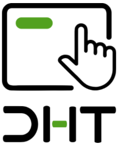

<!-- prettier-ignore-start -->
<!-- markdownlint-disable -->

  <h1>Digital Hand Tracking (DHT)</h1>
  
  
<strong>DHT</strong> un sistema de manipulación gestual de imágenes médicas, compuesto por <a target="_blank" href="https://www.ultraleap.com/product/leap-motion-controller/">Leap Motion</a> y un visualizador de imágenes médicas (derivado de <a target="_blank" href="http://ohif.org/"> OHIF</a>). El objetivo de <b>DHT</b> es facilitar la visualización y manipulación de imágenes médicas para reducir inconvenientes relacionados con los procedimientos de visualización de imágenes diagnósticas que involucran contacto directo con superficies en entornos quirúrgicos.

  <a target="_blank" href="https://es-la.facebook.com/HCIUis/videos/1855025047965040/"><strong>Vídeo de presentación</strong></a> |
  <a href="#">Nexus team</a>

## Sobre DHT

### Requerimientos

- [Yarn 1.17.3+](https://yarnpkg.com/en/docs/install)
- [Node 10+](https://nodejs.org/en/)
- Yarn Workspaces debe activarse con:
  - `yarn config set workspaces-experimental true`
- Leap Motion Controller SDK (TouchFree-1.1.0)

## Licencia
Este proyecto se realizó con fines académicos bajo la licencia MIT.  Derechos de terceros atribuidos a UltraLeap (Leap Motion) y OHIF (Visualizador).
